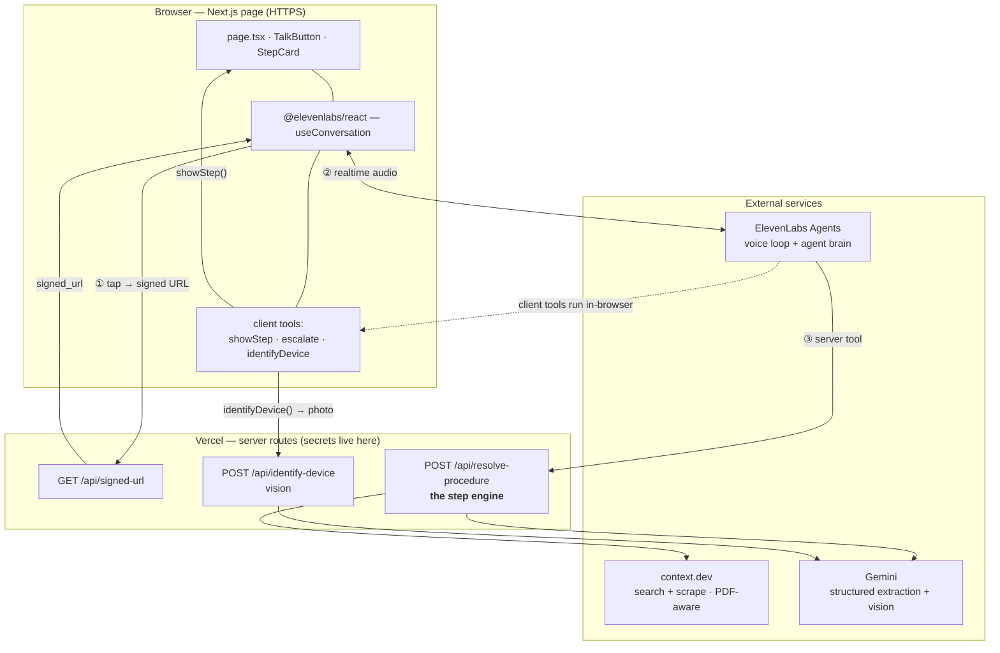
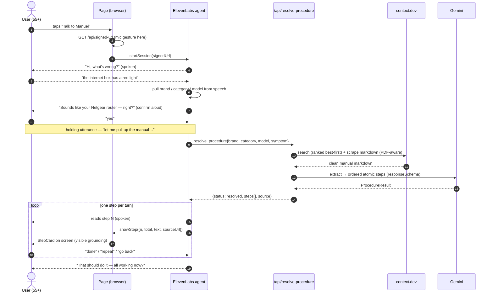

# Manuel — Technical Spec

Manuel is a voice-first web app: a non-technical person fixes a device by *talking* to it. "A manual that talks back."

## 1. Problem

**Who:** someone 55+, low tech confidence, hands and eyes occupied — the device in one hand, the phone in the other. **The pain:** a device stops working (router shows a red light, printer won't print, dishwasher shows `E-04`) and every option is bad — the 90-page PDF they won't open, ten forum threads for the wrong model, a chatbot that confidently invents eight steps in one breath, or "call your son." **Why voice:** they won't scroll, won't type a model number, won't read. The failure mode isn't the model's *ignorance* — it's **pace, trust, and grounding**. Manuel delivers guidance that is **grounded** (every step traceable to the real manual, no invention), **paced** (one spoken step per turn, waits for confirmation), and **patient** ("repeat / go back / slower" are first-class) — spoken, from a link, nothing to install. It replaces "call your son."

## 2. Architecture (data flow)

One Next.js page + a few server routes on Vercel (HTTPS — the mic is blocked on non-secure origins). **ElevenLabs owns the entire voice loop** (STT, TTS, turn-taking, barge-in) as *agent configuration*, not app code. Our code is the page that renders the current step and the tools the agent calls (secrets can't live in the browser).

**Reading it:** the browser mints a signed URL server-side (① — the ElevenLabs key never reaches the client), opens a realtime audio channel to the agent (②), and the agent drives everything by calling tools. **Server tools** (`resolve_procedure`) run on Vercel because they hold secrets; **client tools** (`showStep`, `escalate`, `identifyDevice`) run in the browser because they touch the DOM.

### Request lifecycle (user → user)

How one problem travels from a spoken symptom to a spoken step and back:

If retrieval finds no grounded manual, `/api/resolve-procedure` returns **safe generic steps** (or `safety_refusal` / `no_documentation`) instead — the one-step-per-turn loop is identical.

**The step engine (`/api/resolve-procedure`) is the product:**
1. **Discover** — committed **seed map** first, else **context.dev** `/web/search`, results **ranked best-first** by manual-likeness (direct PDFs and full-manual hosts over marketing landing pages).
2. **Retrieve** — **context.dev** `/web/scrape/markdown` → clean markdown, **PDF-at-URL auto-parsed**; error/stub pages rejected at the boundary.
3. **Construct** — **Gemini** structured output (`responseSchema` mirrors our TypeScript `Procedure` type) → ordered, atomic steps, each carrying a source anchor.
4. It tries the **top few candidates in turn** and returns the first grounded procedure; if none does, it falls back to **safe, clearly-labelled generic guidance**, and unsafe symptoms (mains/gas) return `safety_refusal`. The route **always returns HTTP 200 with a typed body**, so the agent always has something safe to say. Because each step is a structured object, "go back / repeat" is array indexing — not a memory problem. Retrieval is a **tool call, not pre-stuffed context**, so token cost stays proportional and the agent can re-retrieve mid-session.

## 3. Tool rationale

- **ElevenLabs Agents — the voice loop.** Real-time STT/TTS/turn-taking/barge-in is a hard, undifferentiated problem; buying it lets 100% of the effort go to grounding. A chat widget has no barge-in and the wrong pace; rolling our own is months of latency/echo work.
- **context.dev — retrieval.** `/web/search` finds the manual and `/web/scrape/markdown` returns clean, LLM-ready markdown with **PDF-at-URL auto-parsed** — one feature closes the biggest risk (manuals are PDFs), with no second search vendor. Beats a raw `fetch` + custom HTML/PDF parsing (brittle, slow to build); failed calls aren't billed.
- **Gemini (`@google/genai`) — procedure construction.** `responseMimeType: "application/json"` + `responseSchema` force the output to **mirror our types** — the model fills a schema, we don't parse free-form prose. That schema is exactly where "one atomic action per step," "a source anchor on every step," and "refuse to invent" are enforced. `gemini-3.6-flash` for latency-sensitive extraction; the same client does the vision read (§5).
- **Next.js on Vercel.** One repo for the page *and* the secret-holding routes, **HTTPS from hour one** (mandatory for the mic), auto-deploy on push.

## 4. Feasibility (6 hours)

Feasible because **ElevenLabs removes the hardest problem.** The estimating trap is treating conversational behaviour — one step per turn, waits for confirmation, barge-in, holding utterances, safety refusals — as *app features*. They aren't; they're **agent configuration**. The real code surface is one page + a handful of routes.

- Deploy an empty Next.js app to Vercel over **HTTPS first** (the mic is blocked otherwise).
- `/api/signed-url` + TalkButton → a session starts and Manuel talks — prove the voice layer end-to-end on a real phone early.
- `/api/resolve-procedure` (the step engine) — **testable in isolation with `curl`**, so the hard part is debuggable in parallel with the ElevenLabs wiring.
- Wire `resolve_procedure` + `showStep` into the agent; one step per turn.
- Safety refusal + generic fallback + the `escalate` gag.
- Seed ~5 demo devices and rehearse; ranked live search handles the ones we've never seen.

**De-risking:** the seed map guarantees demo retrieval, PDF auto-parse removes the "it's a PDF" unknown, and every failure degrades to a typed HTTP 200 — no crash, always something safe to say.

## 5. Extensibility (v2)

The step engine and retrieval sit behind a clean, vendor-agnostic tool interface (`{brand, category, model, symptom}` in → a structured `ProcedureResult` out), so each step is **additive** — ElevenLabs stays the only replaceable single-vendor dependency.

- **Vision device ID (already scaffolded in this repo).** Photograph the rating label → Gemini reads brand/model plus a **grounded visual diagnosis** (which lights are on, what's unplugged, on-screen error codes); low confidence falls back to voice; photos are ephemeral (in memory, never stored). `/api/identify-device`, `lib/vision.ts`, and the capture UI exist today.
- **Document cache** — raw manual markdown keyed by device identity, with a TTL (the seed map is a pre-warmed version of this).
- **Resolution memory** — persist solved/failed sessions as **cases** keyed on a canonicalised symptom; case-first retrieval as a *shortcut*, never silently replacing the manual. Adds a per-device **RAG index** over long manuals.
- **Home profile → commercial** — a per-home device registry so identity is known *before* a session starts; then a multi-tenant, embeddable widget pointing the *same engine* at a retailer/ISP/manufacturer's catalogue for support-call deflection.

*Live: https://manuel-seven.vercel.app*
