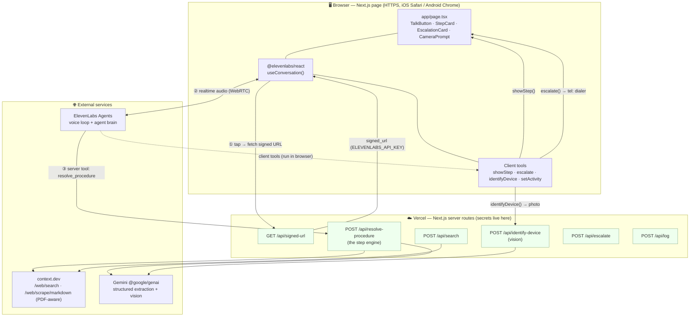
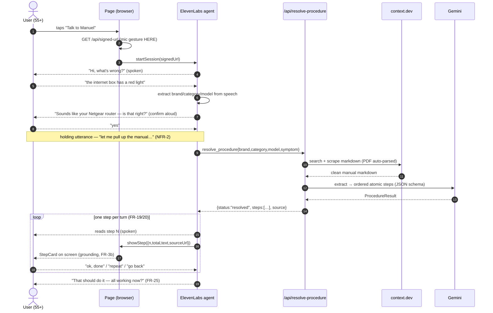
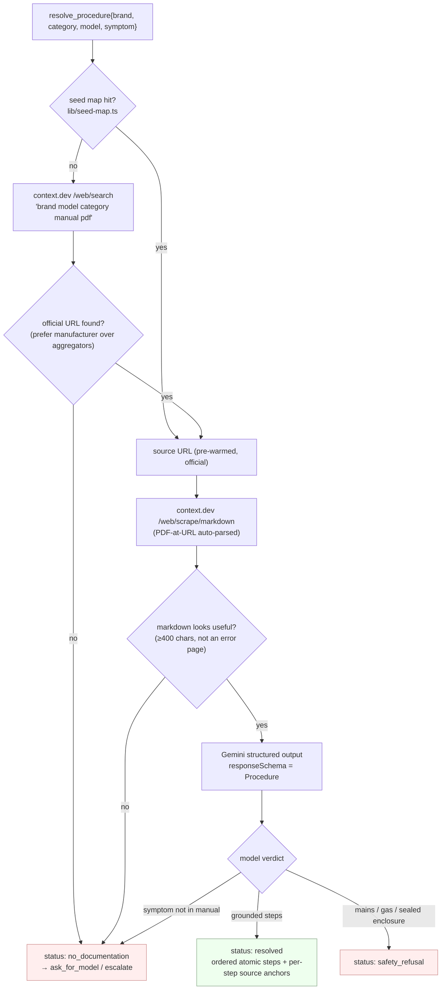
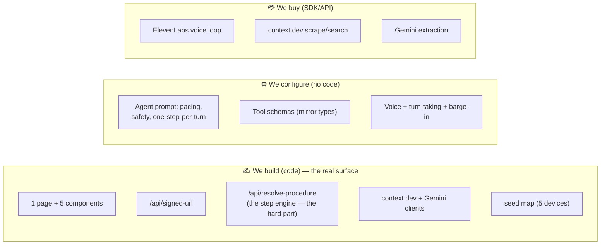
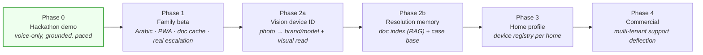

# Manuel — Technical Specification

> **Manuel** is a voice-first web app that helps a non-technical person fix a device by *talking* to it — "a manual that talks back." This spec covers the problem, the system architecture, why each tool was chosen, how it's buildable in a six-hour hackathon window, and what v2 looks like.
>
> Companion docs: [`architecture.md`](architecture.md) · [`api-contracts.md`](api-contracts.md) · [`agent-config.md`](agent-config.md) · [`phases/`](phases/)

---

## 1. The problem

A non-technical person — think 55+, low tech confidence — has a device that stopped working: the router has a red light, the printer won't print, the dishwasher shows `E-04`. Their options today are all bad:

- **The manual** is a 90-page PDF they won't open, can't search, and wouldn't understand.
- **A web search** returns ten forum threads of conflicting advice for the wrong model.
- **A chatbot** confidently invents steps and dumps eight of them in one breath.
- **"Call your son"** — the actual thing they do, and the thing that doesn't scale.

The user's hands and eyes are **occupied**: the device is in one hand, the phone in the other. They will not scroll, will not type a model number, will not read. Every existing self-serve option assumes a literate, patient, screen-focused user. This one isn't.

### What actually solves it

The core bet is **not** "an LLM that knows about routers." A general model knows plenty and still fails this user, because the failure mode isn't *ignorance* — it's **pace, trust, and grounding**:

1. **Grounded** — every instruction is traceable to the *real* manual for the *actual* model. No invention. When the manual doesn't cover it, Manuel says so.
2. **Paced** — exactly **one spoken step per turn**, and it waits for confirmation before advancing. Never a wall of instructions.
3. **Patient** — "repeat," "go back," "slower," "I don't see it" are all first-class, handled without losing place.

Manuel exists to replace "call your son." Success is a frustrated person fixing their own device by talking to a link — no install, no typing, no reading.

### Design constraints (the shape of the solution)

| ID | Constraint | Consequence |
|---|---|---|
| **C-1** | ElevenLabs owns the entire voice loop (STT, TTS, turn-taking, barge-in) — mandated | Everything conversational is *agent configuration*, not app code |
| **C-4** | Web only — no native app | Runs from a URL; mic needs HTTPS + a user tap (iOS Safari) |

C-1 is the single most important constraint: it means the expensive, undifferentiated real-time-audio problem is **bought**, and our engineering concentrates entirely on the part that *is* the product — the **grounded step engine**.

---

## 2. Architecture

Manuel reduces to **one page + a few server routes**. The conversation lives in ElevenLabs configuration; the code is just the tools the agent calls (because secrets can't live in the browser) and the page that renders the current step.

### 2.1 System diagram

**Reading it:** the browser mints a signed URL server-side (① — the ElevenLabs key never reaches the client), opens a realtime audio channel to the ElevenLabs agent (②), and the agent drives everything by calling tools. **Server tools** (like `resolve_procedure`) run on Vercel because they hold secrets; **client tools** (`showStep`, `escalate`, `identifyDevice`) run in the browser because they touch the DOM — rendering the step, opening the dialer, capturing a photo.

### 2.2 End-to-end session flow

The screen is **secondary** on purpose: the flow is complete with audio alone. The on-screen step + source link (FR-3b) exist as *visible proof of grounding* for a bystander or family admin — not for the primary user, who isn't looking at it.

### 2.3 Component responsibilities

| Layer | Responsibility | Phase 0 component |
|---|---|---|
| Delivery | Landing page, session control, on-screen step + source | Next.js on Vercel (HTTPS) |
| Voice interface | STT, TTS, turn-taking, barge-in, transport | ElevenLabs Agents (mandated, C-1) |
| Orchestration | Session state, step engine, tool routing | The agent + server routes |
| Device ID | Brand/category/model from speech (or photo, 2a) | The agent (LLM); Gemini vision (2a) |
| Doc discovery | Device identity → candidate manual URL | Seed map, then `context.dev /web/search` |
| Doc retrieval | URL → clean structured text (PDF-aware) | `context.dev /web/scrape/markdown` |
| Procedure construction | Manual markdown → ordered atomic steps | Gemini structured output |
| On-screen grounding | Show current step + source, in sync | `showStep` client tool → React state |
| Escalation | Summarise + reach a human | `escalate` client tool → dialer (gag) |

### 2.4 The step engine (`/api/resolve-procedure`) — where the product lives

This route is the actual product. It turns a spoken symptom into a **structured, grounded procedure**:

Three properties make this the product and not a chatbot:

- **The procedure is a structured object** — a `steps[]` array with source anchors and branch conditions ([`lib/procedure.ts`](../lib/procedure.ts) is the single source of truth). "Go back" and "repeat" become array indexing, not a memory problem.
- **Retrieval is a tool call, not pre-stuffed context** — keeps the conversation responsive, lets the agent re-retrieve mid-session if the problem turns out different, and keeps token cost proportional to need.
- **Failure is structural, not vibes** — `no_documentation` and `safety_refusal` are first-class outcomes in the schema. The extractor is *instructed to refuse to invent*. The route **always returns HTTP 200 with a typed body** — every failure degrades to `no_documentation` so the agent always has something safe to say (NFR-9).

### 2.5 The vendor-isolation boundary (R-16)

ElevenLabs is a single-vendor dependency for the whole conversation layer — accepted under C-1. The mitigation is architectural: **the step engine and retrieval tool are vendor-agnostic behind a clean tool interface.** They take plain JSON (`{brand, category, model, symptom}` in, a structured `ProcedureResult` out) and know nothing about ElevenLabs. If the voice layer ever needs replacing, it is the *only* thing that changes — and this same boundary enables the Phase 4 multi-tenant product.

---

## 3. Tool rationale (why each choice)

| Concern | Choice | Why this, and why not the obvious alternative |
|---|---|---|
| **Voice loop** | **ElevenLabs Agents** | Mandated (C-1), and correctly so: real-time STT/TTS/turn-taking/barge-in is a hard, undifferentiated problem. Buying it lets 100% of our effort go to grounding. *Not* rolling our own (months of latency/echo work) or a chat widget (no barge-in, wrong pace). |
| **App framework** | **Next.js on Vercel** | One repo gives us the page *and* the server routes that hold secrets. Vercel gives **HTTPS from hour one** — non-negotiable because the mic is blocked on non-secure origins. Auto-deploy on push. |
| **Doc discovery** | **`context.dev /web/search`** + a committed **seed map** | The BRD's "architectural gap" was that context.dev isn't a search engine — but it *has* `/web/search`, closing it without a second search vendor. The seed map pre-warms demo devices so live retrieval is the "…and it handles ones we've never seen" moment, not a single point of demo failure. |
| **Doc retrieval** | **`context.dev /web/scrape/markdown`** | URL → clean, LLM-ready markdown, and **PDF-at-URL is auto-parsed** — this single feature closes the biggest retrieval risk (manuals are PDFs). Failed calls aren't billed. We reject error/stub pages at the boundary (`<400` chars or "access denied"/"404") so garbage never reaches Gemini. *Not* a raw `fetch` + custom HTML/PDF parsing (brittle, slow to build). |
| **Procedure construction** | **Gemini (`@google/genai`) structured output** | `responseMimeType: "application/json"` + `responseSchema` forces the output to *mirror our TypeScript types* — the model fills a schema, it doesn't free-form prose we then parse. No temperature/prefill restrictions. `gemini-3.6-flash` for latency-sensitive extraction (swappable to `-pro`). The schema is where "one atomic action per step," "source anchor on every step," and "refuse to invent" are enforced. |
| **Vision device ID** (2a) | **Gemini multimodal** | Same client, same structured-output discipline — a photo of the rating label → `{brand, model, category, confidence}` + a *grounded visual read* (which lights are on, what's unplugged). Reuses the extraction infrastructure rather than adding a vision vendor. |
| **On-screen step** | **Client tool `showStep` → React state** | Client tools run in-browser and can touch the DOM, so the step renders **in sync with the voice** (FR-3b). Keeps the screen a thin echo of the conversation. |
| **Escalation** | **Client-side `tel:` link (demo gag)** | When Manuel can't help, it *calls the son* — the exact human it replaces — via `tel:+971508888888`, summary on screen. **No Twilio, no server route, no second agent** for the demo. (A server `/api/escalate` exists only to *record* the escalation for observability; the dialer is inherently client-side.) |
| **Types** | **One source of truth: `lib/procedure.ts`** | The Gemini `responseSchema` and the ElevenLabs tool schemas *mirror* these types. Change the type → change both mirrors in the same commit. Prevents the classic drift between "what the model returns" and "what the UI renders." |

### Tools the agent can call

| Tool | Kind | Runs | Does |
|---|---|---|---|
| `resolve_procedure` | server | Vercel | The step engine — symptom → grounded procedure |
| `search_documentation` | server | Vercel | Explicit manual search via context.dev (discovery only) |
| `identifyDevice` | client | browser | Reveals camera, captures a photo, returns a grounded vision read (2a) |
| `showStep` | client | browser | Renders the current step + source link on screen |
| `escalate` | client | browser | Shows the summary card + opens the phone dialer (gag) |
| `setActivity` | client | browser | Drives the "what Manuel is doing" banner during slow server work |

---

## 4. Six-hour feasibility

The build is feasible in a hackathon window **because C-1 removes the hardest problem**. The estimating trap is treating conversational behaviour (one step at a time, waits for confirmation, barge-in, holding utterances, safety refusals) as *app features* — they aren't. They're **agent configuration** in the ElevenLabs dashboard. Our real code surface is a page and a handful of routes.

### What we actually build vs. what we configure/buy

### A rough six-hour plan

| Time | Milestone | Why it's ordered this way |
|---|---|---|
| **0:00–0:30** | Deploy an empty Next.js app to Vercel over **HTTPS** | Mic is blocked on non-secure origins — deploy *before* features, not after |
| **0:30–1:30** | `/api/signed-url` + `TalkButton` → a session starts and Manuel talks | Proves the mandated voice layer end-to-end on the real demo iPhone early (R-13) |
| **1:30–3:30** | `/api/resolve-procedure`: seed → context.dev → Gemini structured output | The core product; test with `curl` independently of the voice layer |
| **3:30–4:30** | Wire `resolve_procedure` + `showStep` into the agent; one step per turn | The pacing behaviour — verified against the runbook's pivot test |
| **4:30–5:15** | Safety refusal + `no_documentation` + `escalate` gag | The guardrail and the human safety-net demo beats |
| **5:15–6:00** | Seed the 5 demo devices, pre-warm, rehearse on the real phone | De-risk the stage — one non-seeded device to prove live retrieval |

### What makes the deadline hold (de-risking)

- **The step engine is testable in isolation** — `curl POST /api/resolve-procedure` needs no voice layer, so the hard part is debuggable in parallel with the ElevenLabs wiring.
- **The seed map removes stage risk** — 5 committed demo devices never miss retrieval; live search is a bonus, not a dependency.
- **PDF-at-URL auto-parse** closes the single biggest retrieval unknown ("the manual is a PDF") with a vendor feature, not build time.
- **Every failure has a safe fallback** — retrieval failure → `no_documentation`; the demo degrades to a useful generic conversation (NFR-9) instead of a crash.
- **Graceful degradation is built in** — routes always return typed 200s; the agent always has something safe to say.

### The one real risk and its mitigation

Latency breaking the conversation (R-3): a slow tool call leaves dead air and the user talks over the agent. Mitigated by a **holding utterance before the tool call** (NFR-2 — "let me pull up the manual…"), the `setActivity` banner, pre-warming, and `gemini-3.6-flash` for speed. Target: **no dead air longer than 3s**.

---

## 5. What v2 looks like

Phase 0 proves the thesis on stage. v2 is the road from a demo to a product a family — then a business — depends on. The architecture is deliberately shaped so each phase *adds a store or a modality* without rewriting the core: the vendor-isolation boundary (§2.5) and the single-source-of-truth types make each step additive.

### The three stores (kept separate by design)

Conflating these is a known trap. Manuel introduces them across phases:

1. **Document cache** (Phase 1) — raw manual markdown keyed by device identity, with a TTL. *A cache, not RAG.* In Phase 0 the seed map is effectively a pre-warmed version of this.
2. **Document index** (Phase 2b) — the manual chunked and embedded. **RAG over vendor documentation**, for "the answer is on page 61 of a 90-page manual."
3. **Case base** (Phase 2b) — past solved/failed sessions, embedded on a *canonical symptom*. Retrieval over our **own operational history**: high signal ("it worked in this house") but low trust (sample size one) — kept explicitly distinct from the vendor-authoritative stores above.

### Phase-by-phase

- **Phase 1 — Family beta.** Harden the prototype into something a 55+ user relies on unsupervised. **Escalation becomes the headline feature**, no longer a gag: proactively offered after N failed steps (FR-26), available on demand at any time (FR-27), and delivering a **structured summary** — device, problem, steps attempted, outcome of each — to the family administrator (FR-28), plus a manufacturer hand-off for hardware/warranty (FR-29). Around it: **bilingual voice** (Arabic + English, detected from the first utterance, NFR-5), an installable **PWA** (NFR-8c), **session resilience** across screen-lock/backgrounding (NFR-8b), real **PDF manual extraction** (FR-16) and a support-section crawl to the actual troubleshooting page (FR-14). Introduces the **document cache** (store #1, FR-15) and cost instrumentation across voice/LLM/retrieval (NFR-12). Hardening, not a new core.
- **Phase 2a — Vision device ID (already scaffolded).** The user can't always name the device — so they photograph it. Gemini multimodal (mandated, C-3) reads the **rating label** for brand/model (FR-8) plus a **grounded visual diagnosis** (which lights are on, what's unplugged, on-screen error codes). Low confidence gates back to the spoken flow (FR-9); photos are **ephemeral** — processed in memory, never persisted (NFR-11). No new store — it just feeds the same device-identity key. *The `identifyDevice` tool, `/api/identify-device` route, and `lib/vision.ts` already exist in the repo.*
- **Phase 2b — Resolution memory.** Where the product starts to compound. Every resolved session is persisted as a **case** (FR-34); the raw utterance is **canonicalised into a structured symptom** used as the retrieval key (FR-35); **case-first retrieval** short-circuits document lookup on a confident match (FR-36) — offered as a shortcut, never silently substituting for the manual (FR-37). Adds **negative cases** (failed steps, FR-38), **moving per-case confidence** that decays on recurrence or doc/firmware/ISP changes (FR-39, FR-44), a per-device **document index / RAG** (store #2, FR-42), a household **admin surface** (FR-43), and — designed in from day one — multi-tenancy plus an opt-in **global anonymised case base** (FR-40) gated by a **scrub-before-promotion** pipeline (FR-41). Introduces a **vector store** (case embeddings + document index as separate collections) and **relational case records**.
- **Phase 3 — Home profile.** A per-home **device registry** (FR-10): register devices once so identity is known *before* a session starts, skipping identification entirely for known devices — the single biggest win on time-to-first-step and wrong-device rate (R-1). No new store type; it produces the same device-identity key the cache and case base already consume. Target: document-cache hit rate ≥ 70% in steady state (NFR-13).
- **Phase 4 — Commercial.** The multi-tenant product (BG-3): a retailer, ISP, or manufacturer points Manuel at their own catalogue for **support-call deflection**, via a drop-in **embeddable widget** on their site. Activates the Phase 2b tenant-aware schema (an activation, not a retrofit) with **per-tenant** cache, index, and case base, and switches on the cross-tenant **global anonymised case base** (FR-40) — where scrubbing (FR-41) is load-bearing, since one leak destroys the proposition (R-12). This is why the step engine was isolated behind a clean tool interface from day one: the commercial product is the *same engine* with a tenant's document set, leaving ElevenLabs the only replaceable single-vendor dependency (R-16).

---

## Appendix — where things live

| Concern | File(s) |
|---|---|
| Shared types (source of truth) | [`lib/procedure.ts`](../lib/procedure.ts) |
| Step engine route | [`app/api/resolve-procedure/route.ts`](../app/api/resolve-procedure/route.ts) |
| Gemini extraction (grounding) | [`lib/extraction.ts`](../lib/extraction.ts) · [`lib/gemini.ts`](../lib/gemini.ts) |
| context.dev client | [`lib/contextdev.ts`](../lib/contextdev.ts) |
| Vision (2a) | [`lib/vision.ts`](../lib/vision.ts) · [`app/api/identify-device/route.ts`](../app/api/identify-device/route.ts) |
| Seed map | [`lib/seed-map.ts`](../lib/seed-map.ts) |
| Client tools | [`lib/clientTools.ts`](../lib/clientTools.ts) |
| The page | [`app/page.tsx`](../app/page.tsx) |
| Agent config (prompts/tools) | [`docs/agent-config.md`](agent-config.md) |
| Full contracts + schema | [`docs/api-contracts.md`](api-contracts.md) |

*Live version: https://manuel-seven.vercel.app/*
